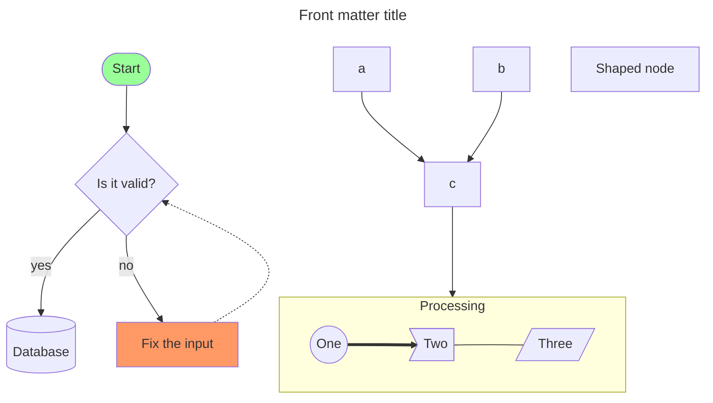
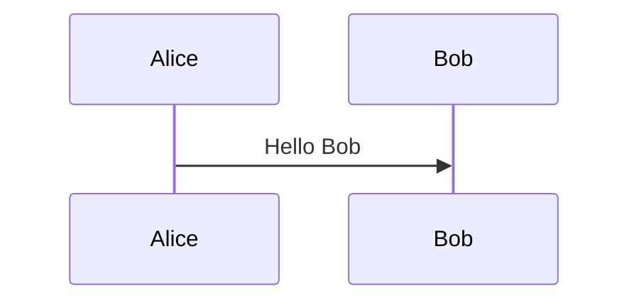

# Diagrams

```mermaid
---
title: Front matter title
---
%% a comment
flowchart TD
    start([Start]) --> check{"Is it valid?"}
    check -->|yes| save[(Database)]
    check -- no --> fix[Fix the input]:::warn
    fix -.-> check
    a & b --> c
    subgraph proc [Processing]
        direction LR
        p1((One)) ==> p2>Two]; p2 --- p3[/Three/]
    end
    c --> proc
    n1@{ shape: rect, label: "Shaped node" }
    classDef warn fill:#f96
    style start fill:#9f9
```

```mermaid
sequenceDiagram
    Alice->>Bob: Hello Bob
```
